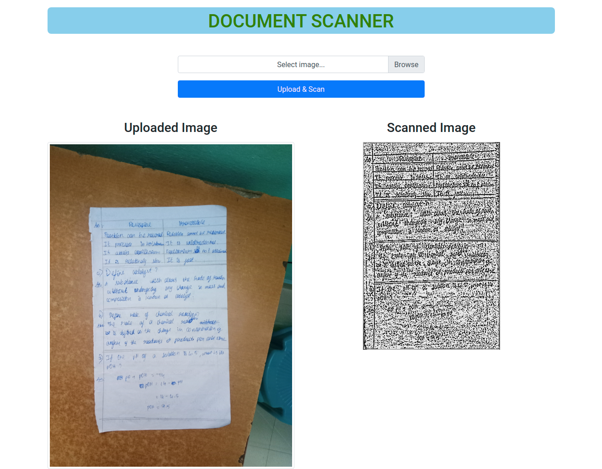

<h1 align="center">Document Scanner</h1>

## Sample Input / Output

## Process Taken to Scan Image

- Converting JPG image to RGB matrix format.
- Resizing RGB Image Matrix to 640 x 480 pixels.
    - Group of pixels are replaced by a single pixel with their mean value.
- Converting RGB Image Matrix to Grayscale Image matrix
    - Gray = (Red + Green + Blue) / 3
    - References: [Grayscale to RGB Conversion - Tutorialspoint](https://www.tutorialspoint.com/dip/grayscale_to_rgb_conversion.htm#:~:text=Since%20its%20an%20RGB%20image,get%20your%20desired%20grayscale%20image.&text=If%20you%20have%20an%20color,into%20grayscale%20using%20average%20method.)
- Giving 1px black border on all four sides for calculation process.
- Detecting the Edges using CANNY EDGE DETECTION TECHNIQUE.
    1. Applying GAUSSIAN BLUR effect to Grayscale image to reduce noise.
    2. Finding Intensity Gradients of the image - Magnitude and Angle.
    3. Applying non-max suppression to the smoothened image using magnitude and angle.
    4. Double Threshold
    5. Edge Tracking by Hysteresis to process weak pixels.
    - References :
        - [Canny edge detector - Wikipedia](https://en.wikipedia.org/wiki/Canny_edge_detector)
        - [Gaussian blur - Wikipedia](https://en.wikipedia.org/wiki/Gaussian_blur)
        - [Canny Edge Detection Step by Step in Python — Computer Vision](https://towardsdatascience.com/canny-edge-detection-step-by-step-in-python-computer-vision-b49c3a2d8123)
        - [Sobel Operator - Tutorialspoint](https://www.tutorialspoint.com/dip/sobel_operator.htm)
- Applying Dilation and Erosion to reduce noises.
    - References : [Erosion and Dilation in Image Processing | Morphological operations](https://www.youtube.com/watch?v=2LAooUu1IjQ)
- Cropping images by detecting the edges.
- Scanning Image
    - Adaptive Thresholding
        - References: [Point Operations - Adaptive Thresholding](http://homepages.inf.ed.ac.uk/rbf/HIPR2/adpthrsh.htm)

